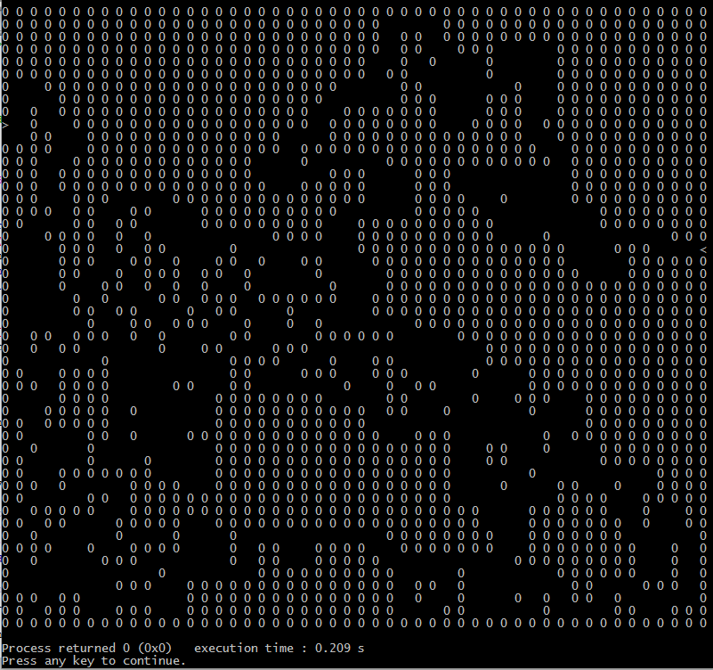

# Características

* É gerado uma entrada (caractér '>') e uma saída (caractér '<') 
* Baseado na entrada o sistema cria caminhos até chegar na saída
* Utiliza backtrack

## Bugs encontrados

* Ele não gera um labirinto corretamente se a matriz não for quadrada (as vezes)

